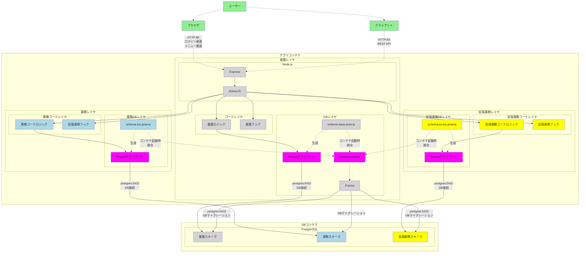

# コンポーネント構成

---

# astack-adminjs

# コンポーネント構成

```mermaid
graph TD
    US[ユーザー]
    style US fill:lightgreen
    CL1[ブラウザ]
    style CL1 fill:lightgreen
    CL2[クライアント]
    style CL2 fill:lightgreen
    US -.-> CL1
    US -.-> CL2
    CL1 -.-> |HTTP:80<br>ログイン画面<br>メニュー画面| ND
    CL2 -.-> |HTTP:80<br>REST API| ND
    subgraph DBコンテナ
        subgraph PostgreSQL
            PO[基盤スキーマ]
            style PO fill:lightgray
            BZ.PO[業務スキーマ]
            style BZ.PO fill:lightblue
            EX.BZ.PO[拡張業務スキーマ]
            style EX.BZ.PO fill:yellow
        end
    end
    subgraph アプリコンテナ
        subgraph 基盤レイヤ
            ND[Express]
            style ND fill:lightgray
            AJ[AdminJS]
            style AJ fill:lightgray
            subgraph Node.js
                ND --> AJ
            end
            subgraph コードレイヤ
                CD.APP[基盤ロジック]
                style CD.APP fill:lightgray
                CD.HOOK[基盤フック]
                style CD.HOOK fill:lightgray
                AJ --> CD.APP
                AJ --> CD.HOOK
            end
            subgraph DBレイヤ
                PR.CL[Prismaクライアント]
                style PR.CL fill:magenta
                PR[Prisma]
                style PR fill:lightgray
                PR.BS.SC[schema.base.prisma]
                style PR.BS.SC fill:lightgray
                PR.SC[schema.prisma]
                style PR.SC fill:magenta
                CD.APP --> PR.CL
                PR.BS.SC -.-> |生成| PR.CL
                PR.BS.SC -.-> |コンテナ起動時<br>統合| PR.SC
                PR.SC -.-> PR
                PR.CL --> |postgres:5432<br>DB接続| PO
                PR --> |postgres:5432<br>DBマイグレーション| PO
            end
        end
        subgraph 業務レイヤ
            subgraph 業務コードレイヤ
                BZ.CD.APP[業務コードロジック]
                style BZ.CD.APP fill:lightblue
                BZ.CD.HOOK[拡張業務フック]
                style BZ.CD.HOOK fill:lightblue
            end
            subgraph 業務DBレイヤ
                BZ.PR.SC[schema.biz.prisma]
                style BZ.PR.SC fill:lightblue
                BZ.PR.CL[Prismaクライアント]
                style BZ.PR.CL fill:magenta
            end
            AJ --> BZ.CD.APP
            AJ --> BZ.CD.HOOK
            BZ.CD.APP --> BZ.PR.CL
            BZ.PR.SC -.-> |生成| BZ.PR.CL
            BZ.PR.SC -.-> |コンテナ起動時<br>統合| PR.SC
            BZ.PR.CL --> |postgres:5432<br>DB接続| BZ.PO
            PR --> |DBマイグレーション| BZ.PO
        end
        subgraph 拡張業務レイヤ
            subgraph 拡張業務コードレイヤ
                EX.BZ.CD.APP[拡張業務コードロジック]
                style EX.BZ.CD.APP fill:yellow
                EX.BZ.CD.HOOK[拡張業務フック]
                style EX.BZ.CD.HOOK fill:yellow
            end
            subgraph 拡張業務DBレイヤ
                EX.BZ.PR.SC[schema.ex.biz.prisma]
                style EX.BZ.PR.SC fill:yellow
                EX.BZ.PR.CL[Prismaクライアント]
                style EX.BZ.PR.CL fill:magenta
            end
            AJ --> EX.BZ.CD.APP
            AJ --> EX.BZ.CD.HOOK
            EX.BZ.CD.APP --> EX.BZ.PR.CL
            EX.BZ.PR.SC -.-> |生成| EX.BZ.PR.CL
            EX.BZ.PR.SC -.-> |コンテナ起動時<br>統合| PR.SC
            EX.BZ.PR.CL --> |postgres:5432<br>DB接続| EX.BZ.PO
            PR --> |postgres:5432<br>DBマイグレーション| EX.BZ.PO
        end
    end
```
